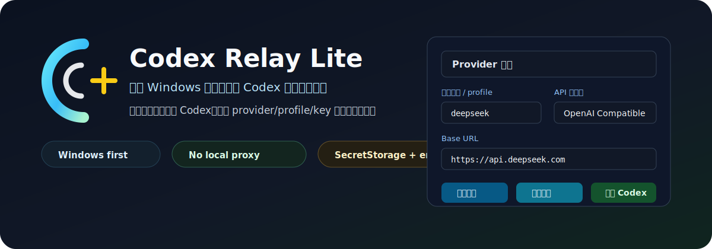
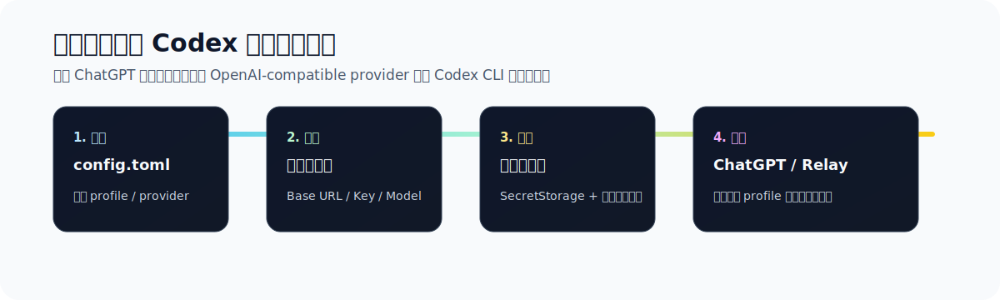

# Codex Relay Lite

<p align="center">
  
</p>

<p align="center">
  <a href="LICENSE"></a>
  
  
  
</p>

Codex Relay Lite 是一个面向中文 Windows 用户的极简 Codex 中转站配置器。

它不是 AI 编程工具，不是代理服务器，不接管 Codex，也不替代 CC Switch。它只解决一个很小但很烦的问题：不想手改 `~/.codex/config.toml`，也不想装复杂代理，只想用一个清爽的中文表单界面，把 DeepSeek、OpenAI-compatible 中转站、LiteLLM Local 或 Ollama 接到 Codex CLI。

<p align="center">
  
</p>

## 为什么值得做

Codex CLI 已经很强，但 custom provider 的日常使用还会卡在一些琐碎但高风险的地方：profile 怎么写、`wire_api` 怎么选、API Key 放哪里、切回 ChatGPT 账号登录会不会把配置弄坏、保存前有没有备份。

Codex Relay Lite 的价值不是“大而全”，而是把这条链路做成一个小闭环：

- 读当前 `~/.codex/config.toml`
- 用表单新增或更新中转站 profile
- 从 `/models` 拉取可用模型
- 用 Codex 当前需要的 `/responses` 测试连接
- 保存前自动备份
- API Key 不写入 TOML
- 一键在 ChatGPT 账号登录和中转站 profile 之间切换

## 功能

- 中文 VS Code Activity Bar 页面
- 支持 DeepSeek / OpenAI Compatible / LiteLLM Local / Ollama
- 读取并展示当前默认 profile、Codex 配置路径、Codex 命令状态
- 新增、编辑、应用 Codex 中转站 profile
- 始终保留 ChatGPT 账号登录入口
- 切回 ChatGPT 时删除顶层 `profile`，走 Codex 原生账号登录路径
- API Key 保存到 VS Code SecretStorage，并同步到 Windows 用户环境变量
- UI 只显示密钥长度和点状掩码，不明文回显
- 保存前备份 `config.toml`
- 从中转站 `/models` 获取模型列表
- 测试 `/responses`
- 复制或打开 `codex -p <profile>`
- 不自动修改 OpenAI/Codex 扩展的 `chatgpt.cliExecutable`

## 安装

普通用户不需要 clone 源码运行。下载 Release 里的 `codex-relay-lite-*.vsix`，然后在 VS Code 中安装：

1. 打开 VS Code。
2. 进入扩展面板。
3. 点击右上角 `...`。
4. 选择 **Install from VSIX... / 从 VSIX 安装**。
5. 选择下载好的 `.vsix` 文件。

开发者可以从源码运行：

```powershell
npm install
npm run check
npm run package
```

在 VS Code 打开本目录，按 `F5` 启动 Extension Development Host，然后点击左侧 **Codex Relay Lite**。

## 使用

### 添加中转站

1. 选择 API 提供商。
2. 填写 Base URL、API Key、模型名。
3. 点击 **刷新模型**，从中转站拉取模型列表，也可以继续手填。
4. 点击 **测试连接**。
5. 点击 **保存配置**。
6. 需要设为默认时，勾选 **设为默认 profile** 或在 Profile 列表点击 **应用**。

DeepSeek 官方示例：

```text
Base URL: https://api.deepseek.com
wire_api: responses
```

OpenAI-compatible 中转站示例：

```text
Base URL: https://your-relay.example.com/v1
wire_api: responses
```

### 切换 profile

在 **Profile 切换** 区域：

- 点中转站的 **应用**：写入顶层 `profile = "xxx"`，保存前自动备份。
- 点 ChatGPT 的 **应用**：删除顶层 `profile`，让新版 Codex 账号登录走原生默认路径。
- 点 **复制**：复制 `codex -p <profile>`。
- 点 **打开**：在 VS Code 终端运行 `codex -p <profile>`，并向终端注入对应 API Key。
- 点 **编辑**：把中转站 profile 载入下方表单。

## 写入格式

保存后会写入类似配置：

```toml
[profiles.deepseek]
model_provider = "deepseek"
model = "deepseek-chat"
model_reasoning_effort = "none"
model_reasoning_summary = "none"

[model_providers.deepseek]
name = "deepseek"
base_url = "https://api.deepseek.com"
env_key = "CODEX_RELAY_DEEPSEEK_KEY"
wire_api = "responses"
```

API Key 不写入 `config.toml`。插件会保存到 VS Code SecretStorage，并通过 Windows `setx` 写入用户环境变量。已经打开的 VS Code/Codex 可能读不到刚写入的用户环境变量，从本插件点击 **打开** 会给终端显式注入 key。

## 安全边界

- 不做代理，不转发请求，不保存服务端日志。
- 不管理 Claude Code / Gemini / MCP。
- 不自动修改 `chatgpt.cliExecutable`。
- `chatgpt` 是 Codex 账号登录保留入口，不能作为中转站 profile 名称。
- TOML 更新采用保守块替换策略，只处理 `[profiles.<name>]` 和 `[model_providers.<name>]` 简单 profile。
- 每次保存前会备份原文件为 `config.toml.bak.<timestamp>`。
- “测试连接”成功只说明 `/responses` 能返回基础响应；能否稳定运行 Codex agent 工具调用，取决于中转站和模型本身的 Responses API/tool calling 兼容性。

## 项目结构

```text
codex-relay-lite/
  extension.js
  package.json
  media/icon.svg
  docs/config-format.md
  docs/assets/
```

## License

MIT
